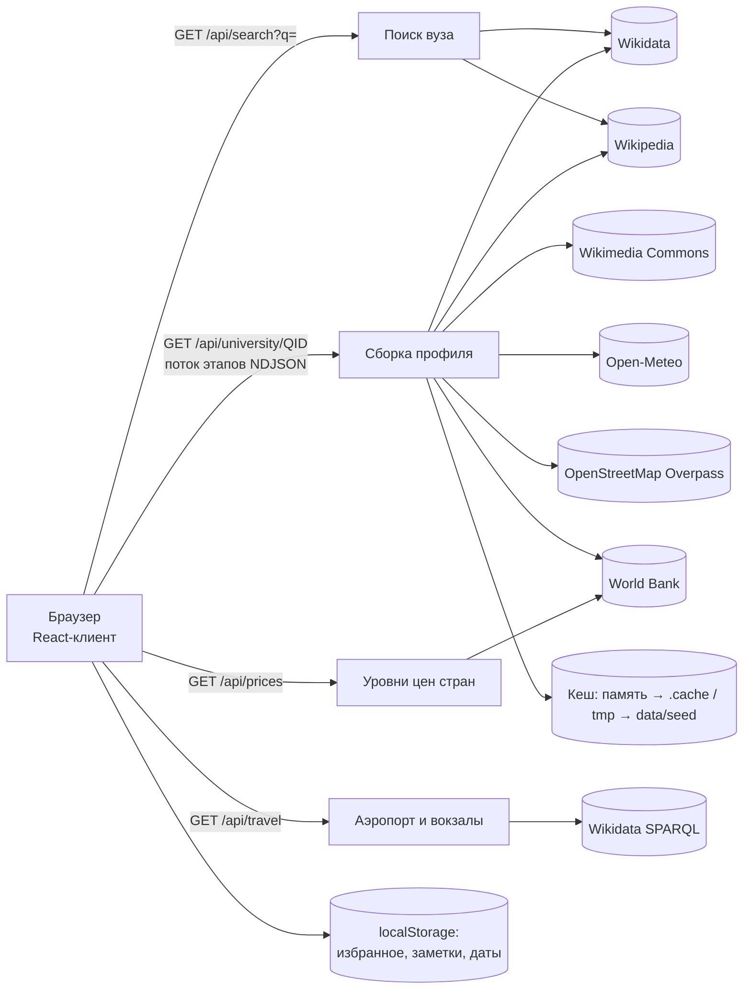

# Uniview: визуальный профиль университета за 30 секунд

**Uniview** помогает абитуриенту «побывать» в университете, куда он не может приехать. Нужно ввести название вуза. Не позже чем через 30 секунд появится профиль:
- реальные фото кампуса, общежитий, аудиторий, библиотек и города, отсортированные по категориям;
- у каждого фото кликабельный источник, дата и степень уверенности;
- описание кампуса, карта, условия жизни и сравнение с другими вузами.

> **Рабочий продукт:** `https://<ваш-проект>.vercel.app` ← *вставить ссылку после деплоя*. Вход не нужен.
>
> **Материалы:**
> - [презентация (PDF, 8 слайдов)](docs/Uniview-presentation.pdf);
> - [сценарий демо-видео](docs/demo-script.md);
> - [техническая справка](#12-техническая-справка) — в этом файле.

---

## Содержание
1. [Задача](#1-задача)
2. [Решение](#2-решение)
3. [Тестовый сценарий для жюри](#3-тестовый-сценарий-для-жюри)
4. [Стек](#4-стек)
5. [Архитектура](#5-архитектура)
6. [Как работает конвейер](#6-как-работает-конвейер)
7. [Источники данных и API](#7-источники-данных-и-api)
8. [AI в проекте](#8-ai-в-проекте)
9. [Готовые компоненты](#9-готовые-компоненты)
10. [Запуск](#10-запуск)
11. [Деплой на Vercel](#11-деплой-на-vercel)
12. [Техническая справка](#12-техническая-справка)
13. [Ограничения](#13-ограничения)
14. [Роли команды](#14-роли-команды)
15. [Структура репозитория](#15-структура-репозитория)

---

## 1. Задача

Абитуриент выбирает вуз в другом городе или стране, но не может приехать и посмотреть его. Фото на сайтах вузов рекламные, а в поиске картинок перемешаны чужие здания, логотипы, стоковые фото и дубликаты.

Сервис по названию вуза должен за **30 секунд**:
1. найти вуз, в том числе по неоднозначному запросу («MIT», «КазНУ», «Cambridge»);
2. собрать фото кампуса, общежитий, аудиторий, библиотек и города;
3. автоматически разложить их по категориям;
4. убрать одинаковые, похожие и нерелевантные изображения;
5. проверить, что фото действительно относится к этому вузу;
6. показать кликабельный источник и дату каждого фото;
7. дать короткое описание кампуса по найденным источникам;
8. дать фильтры: общежитие, спорт, лаборатории, студенческая жизнь.

Главный принцип — **честная неопределённость**: если фото нельзя надёжно подтвердить, сервис снижает уверенность или прямо пишет «недостаточно данных», а не показывает догадку как факт.

## 2. Решение

Uniview — веб-приложение на Next.js. Бэкенд — API-маршруты того же приложения. Всё построено на **бесплатных открытых данных**: платных API и ключей нет.

**Обязательные функции:**

| # | Что требовалось | Как сделано |
|---|---|---|
| 1 | Поиск и неоднозначные запросы | Поиск по Wikidata и Wikipedia на русском и английском, с учётом редиректов: «КазНУ» → Казахский национальный университет. При нескольких совпадениях показывается список, выбор никогда не делается молча |
| 2 | Фото кампуса, общежитий, аудиторий, библиотек, города | Wikimedia Commons: категория вуза и подкатегории, геопоиск вокруг кампуса, поиск по названию, категория города, главное фото из Wikidata |
| 3 | Автосортировка | Правила со взвешенными признаками: название файла, категории Commons, описание. См. [раздел 6](#6-как-работает-конвейер) |
| 4 | Дубликаты и нерелевантное | Точные копии по SHA-1, почти одинаковые — по перцептивному хешу dHash. Отдельно удаляются логотипы, карты, схемы, портреты, сканы книг, микроскопия и фото конкурсов |
| 5 | Проверка принадлежности | Оценка уверенности 0–1: надёжность источника, расстояние геотега до кампуса, упоминание вуза. Статусы «проверено», «вероятно», «требует проверки». У каждой оценки есть объяснение «почему такая оценка» |
| 6 | Источник и дата | У каждого фото ссылка на страницу Commons, автор, лицензия и дата съёмки или публикации. Если даты нет, так и написано: «дата неизвестна» |
| 7 | Описание кампуса | Цитата из Wikipedia со ссылкой и сводка по найденным фото, у каждого блока своя степень уверенности |
| 8 | Фильтры | Карточки «Общежитие», «Спорт», «Лаборатории», «Студенческая жизнь». Можно выбрать несколько; если фото нет, показывается «недостаточно данных» |

**Дополнительно:**
- **карта кампуса** и расстояние до центра города;
- **сравнение 2–4 вузов**: закреплённая шапка, режим «только различия», подсветка лучших значений, фото рядом;
- **город и жизнь**: климат за 5 лет, транспорт рядом, **бюджет студента в месяц** в долларах и местной валюте, **как добраться** из аэропорта и с вокзала;
- **индекс городского комфорта** и доля зелени на фото;
- **общежития рядом** по OpenStreetMap и чек-лист заселения;
- **избранное**: приоритеты, специальности, трекер подачи документов, заметки, свои данные о проходных баллах и стоимости обучения;
- **ссылка для семьи**: список упакован в саму ссылку и не загружается на сервер;
- экспорт в PDF, календарь важных дат с экспортом в `.ics`;
- фильтры по сезону и времени суток, свежие фото, студенческая жизнь;
- интерфейс на **русском и английском**.

## 3. Тестовый сценарий для жюри

Все шаги можно повторить с **любым** вузом, не только из демо.

1. **Неоднозначный запрос.** На главной введите `Cambridge` → появится список вариантов: Кембриджский университет, Тринити-колледж. Выберите «Кембриджский университет». Это демо-вуз, профиль откроется мгновенно.
2. **Главные фото.** Вверху карусель с проверенными фото кампуса. Под каждым фото статус, дата, автор и **кликабельный источник**.
3. **Проверка фото.** Прокрутите до «Фото» и нажмите «Почему такая оценка?» у любой карточки: там причины, например «в категории вуза на Commons» или «геотег в 0,3 км от кампуса».
4. **Фильтры.** Нажмите «Общежитие» или «Лаборатории». Если подходящих фото нет, появится честное «Недостаточно данных».
5. **Вуз не из демо.** Вернитесь на главную и введите `Томский государственный университет`, `Carnegie Mellon` или любой другой вуз. Профиль собирается вживую за **12–18 секунд**; на экране видны 5 шагов: название → поиск → проверка → категории → профиль.
6. **Жизнь в городе.** В разделе «Город и жизнь» есть климат, транспорт, «Как добраться» и «Стоимость жизни для студента». Выберите свою страну — увидите, во сколько раз там дороже или дешевле.
7. **Сравнение.** Нажмите ♡ у 2–3 вузов → «Избранное» → отметьте их → «Сравнить выбранные». Переключите «Только различия».
8. **Язык.** Переключатель EN/RU в шапке.

Демо-вузы, которые открываются мгновенно: Назарбаев Университет, КазНУ им. аль-Фараби, Satbayev University, MIT, Кембриджский университет.

## 4. Стек

| Слой | Технологии |
|---|---|
| Фреймворк | **Next.js 16** (App Router, Turbopack), **React 19**, **TypeScript** |
| Стили и UI | **Tailwind CSS v4**, **shadcn/ui** (base-nova, Base UI), lucide-react, react-icons |
| Анимации | framer-motion, @paper-design/shaders-react (шейдерные карточки фильтров) |
| Карта | Leaflet + react-leaflet, тайлы OpenStreetMap |
| Обработка изображений | sharp: миниатюры, dHash, яркость, доля зелёного |
| Бэкенд | Next.js Route Handlers (Node.js), потоковый ответ NDJSON с этапами |
| Хранение | Без базы данных: кеш в памяти и JSON-файлах. Предрасчитанные демо-данные лежат в `data/seed`. Личные данные пользователя хранятся в `localStorage` браузера |
| Хостинг | Vercel |

## 5. Архитектура



- **Клиент** показывает 5 шагов загрузки и таймер, затем профиль. Избранное, заметки и даты хранятся только в браузере пользователя.
- **`/api/university/[qid]`** собирает профиль в пределах бюджета **25 с** и отдаёт этапы потоком, поэтому пользователь видит прогресс. Жёсткий лимит на клиенте — 30 с.
- Фото и факты о городе не зависят от языка: при переключении RU/EN они берутся из кеша.
- «Как добраться» догружается **после** показа профиля: запрос долгий и не должен съедать 30 секунд.
- Все запросы к внешним API идут через очереди с ограничением параллельности и повтором после ответа 429. Wikimedia API — не больше 3 запросов одновременно, Overpass — 1.

## 6. Как работает конвейер

1. **Название → Wikidata QID.** Поиск в Wikipedia на русском и английском с редиректами, плюс `wbsearchentities`. Остаются только вузы: тип P31 из белого списка или описание про вуз. Люди, здания, лицензии и репозитории отсекаются.
2. **Факты о вузе.** Координаты (P625, иначе из Wikipedia), город (первый населённый пункт среди P276 → P159 → P131), страна и валюта (текущие значения, без исторических), сайт, год основания, число студентов.
3. **Сбор фото** из шести источников параллельно: категория вуза на Commons, её подкатегории (сначала «общежития», «библиотеки» и т. п.), геопоиск в радиусе кампуса, поиск по названию, категория города, изображение из Wikidata.
4. **Фильтр нерелевантного:** логотипы, карты, схемы, гербы, портреты (без геотега, с именем человека в названии), сканы книг, экслибрисы, журналы, микроскопия, конкурсы научных фото.
5. **Оценка уверенности** — объяснимые правила:
   - база по источнику: фото вуза в Wikidata 0,75; категория вуза 0,6; подкатегория 0,5; геопоиск 0,3; поиск по тексту 0,15;
   - геотег ≤0,5 км от кампуса +0,3, ≤1,5 км +0,2, дальше 15 км −0,4;
   - упоминание вуза в названии или описании +0,15; найдено несколькими поисками +0,05;
   - статус: ≥0,75 «проверено», ≥0,5 «вероятно», ниже — «требует проверки»; ниже 0,25 фото удаляется.
6. **Дубликаты.** SHA-1 для точных копий, dHash на миниатюрах 120 px с порогом ≤6 бит для почти одинаковых. Остаётся версия с лучшим источником.
7. **Категории и фильтры.** Взвешенные признаки: название файла, собственные категории Commons и подкатегория вуза дают по 2 балла, описание — 1 балл. Категория или фильтр ставится при ≥2 баллах. Так упоминание мимоходом («…рядом с учебными корпусами…») не делает фото «аудиторией».
8. **Дополнительные признаки по миниатюрам:** сезон (по словам или месяцу съёмки), день или ночь (по яркости), доля зелени.
9. **Город и жизнь:**
   - климат — среднее за 5 лет по данным ERA5;
   - транспорт, парки, кафе и общежития в радиусе 1–3 км — из OpenStreetMap;
   - бюджет — скромная студенческая корзина по ценам США, пересчитанная по уровню потребительских цен страны из данных World Bank.

## 7. Источники данных и API

Все источники бесплатные и без ключей.

| Источник | Что берём | API |
|---|---|---|
| **Wikidata** | поиск вуза, координаты, город, страна, валюта, сайт, год основания, число студентов, главное фото | `wbsearchentities`, `wbgetentities`, SPARQL `query.wikidata.org` (аэропорты, вокзалы) |
| **Wikipedia** (ru, en) | поиск по прозвищам, краткое описание, координаты, если их нет в Wikidata | MediaWiki API, REST `page/summary` |
| **Wikimedia Commons** | фото, автор, лицензия, дата, геотег, категории | MediaWiki API: `categorymembers`, `geosearch`, `search`, `imageinfo`/`extmetadata` |
| **OpenStreetMap** | остановки, станции, кафе, магазины, аптеки, спорт, парки, общежития рядом с кампусом | Overpass API, один объединённый запрос |
| **Open-Meteo** | температура и осадки по месяцам за 5 лет | Archive API (ERA5) |
| **World Bank** | уровень потребительских цен и курс валюты по странам | Indicators API: `PA.NUS.PRVT.PP`, `PA.NUS.FCRF` |
| **OpenStreetMap tiles** | подложка карты | tile.openstreetmap.org |

Wikimedia требует указывать контакт в User-Agent (переменная `WIKIMEDIA_CONTACT`). Контакт отправляется **только** в Wikimedia, остальные сервисы получают обезличенный User-Agent.

## 8. AI в проекте

- **В продукте нет платных AI-моделей и LLM.** Проверка, сортировка и удаление дубликатов сделаны объяснимыми правилами и алгоритмами: оценка источника и геотегов, взвешенные ключевые слова, перцептивные хеши. Так решение работает бесплатно, быстро, укладывается в 30 секунд, и у каждой оценки есть понятная причина.
- Архитектура позволяет добавить vision-модель (например, Claude) как дополнительную проверку только для сомнительных фото. Место в коде — `lib/server/classify.ts`.
- **При разработке** использовался AI-ассистент **Claude Code** (Anthropic): код, аудит классификатора, тесты, документация.

## 9. Готовые компоненты

| Компонент | Откуда | Где используется |
|---|---|---|
| `ContainerScroll` (container-scroll-animation) | Aceternity UI | Главная страница, 3D-прокрутка превью профиля |
| `feature-shader-cards` | 21st.dev + @paper-design/shaders-react | Карточки фильтров «Общежитие / Спорт / Лаборатории / Студенческая жизнь» |
| `image-fan-carousel` (Carousel360) | 21st.dev | Карусель главных фото вверху профиля. Добавлены свойства: свои изображения, отключение автопрокрутки, крупный размер |
| Button и базовые стили | shadcn/ui (base-nova) | Кнопки по всему интерфейсу |
| Карта | Leaflet, react-leaflet | Карта кампуса |
| Иконки | lucide-react, react-icons | Интерфейс |

## 10. Запуск

Нужен Node.js 20+.

```bash
npm install
cp .env.example .env.local     # впишите WIKIMEDIA_CONTACT (ваш email или URL)
npm run dev                    # http://localhost:3000
```

Проверки: `npx tsc --noEmit`, `npm run lint`, `npm run build`.

Обновить предрасчитанные демо-данные: откройте демо-вузы на RU и EN по одному, затем выполните `npm run seed`. Команда скопирует готовые профили из `.cache/` в `data/seed/`.

## 11. Деплой на Vercel

1. Импортируйте GitHub-репозиторий в Vercel.
2. Фреймворк Next.js определится сам; Root Directory оставьте пустым (приложение в корне репозитория).
3. **Settings → Environment Variables:** `WIKIMEDIA_CONTACT` = ваш email или URL. Без него Wikimedia даёт около 10 запросов в минуту, с ним — около 200.
4. Deploy.

Особенности работы на Vercel:
- маршрут профиля объявляет `maxDuration = 30`;
- диск Vercel только для чтения, поэтому новый кеш пишется во временную папку;
- демо-вузы берутся из `data/seed`; `next.config.ts` включает их в функции через `outputFileTracingIncludes`.

## 12. Техническая справка

**Библиотеки** (`package.json`):
- next 16.3.5, react / react-dom 19.2.8, typescript 5;
- tailwindcss 4, shadcn 4 (@base-ui/react 1.8), class-variance-authority;
- framer-motion 13, @paper-design/shaders-react 0.0.80, lucide-react, react-icons;
- leaflet 1.9 + react-leaflet 5;
- sharp 0.35;
- eslint 9 + eslint-config-next.

**Внешние сервисы:**
- Wikidata (API и SPARQL), Wikipedia, Wikimedia Commons;
- OpenStreetMap: Overpass API и тайлы карты;
- Open-Meteo Archive, World Bank Indicators API;
- хостинг Vercel.

Ключи не нужны; единственная переменная окружения — `WIKIMEDIA_CONTACT`.

**Данные:**
- Фото **не копируются** к нам: показываются миниатюры с серверов Wikimedia, с автором, лицензией (в основном CC BY / CC BY-SA) и ссылкой на страницу файла.
- На сервере хранится только кеш собранных профилей: память, временная папка, `data/seed` для демо-вузов. Это открытые данные о вузах, без персональных данных.
- Избранное, заметки, свои данные и даты хранятся только в `localStorage` браузера пользователя.
- Ссылка «поделиться» содержит список в части адреса после `#`, которую браузер не отправляет на сервер.
- Бюджет студента: корзина по ценам США (продукты 350, столовая и кафе 100, транспорт 60, связь 50, личные расходы 100 — итого 660 $ в месяц; это допущение Uniview) умножается на уровень потребительских цен страны = `PA.NUS.PRVT.PP ÷ PA.NUS.FCRF` за последний общий год. В интерфейсе показаны диапазон ±20% и пометка «низкая достоверность».
- Время в пути: расстояние по прямой × 1,3 при скорости 25–60 км/ч в зависимости от расстояния; в интерфейсе подписано как оценка.

**Модели:** нейросетевых моделей нет. Используются:
- правила оценки уверенности (раздел 6);
- dHash — 64-битный разностный перцептивный хеш по миниатюре 9×8;
- расстояние между координатами по формуле гаверсинуса;
- регулярные выражения на русском и английском. Для кириллицы вместо `\b` используется `(?<![а-я])`.

**Время ответа** (измерено):
| Шаг | Время |
|---|---|
| Поиск вуза | 0,8–3,5 с |
| Профиль нового вуза | 12–18 с. Примеры: Томский ГУ 12,4 с, Carnegie Mellon 14,2 с, University of Tokyo 12,3 с |
| Профиль из кеша или демо-данных | 0,05–0,25 с |
| «Как добраться» (отдельно, после профиля) | 2–15 с |

**Методы проверки качества:**
- **Аудит классификатора.** Скрипт заново загружал описание и категории каждого фото с Commons и показывал, какое ключевое слово и где сработало. Найденные ошибки исправлены:
  - подстроки («rowing» внутри «growing»);
  - упоминания мимоходом в описании;
  - микрофотографии и сканы книг в категориях вузов;
  - ложные «портреты».
- **Результат аудита:**
  - у Назарбаев Университета было 60 фото, осталось 33: удалены микроскопия, конкурсные фото, логотип, портрет;
  - в фильтре «Лаборатории» было 6 фото, осталось одно настоящее фото лаборатории;
  - в категории «Библиотеки» у MIT было 9 фото, осталось 3.
- **Ручная проверка в браузере** на английском и русском и на ширине телефона 375 px: нет горизонтальной прокрутки, все состояния «недостаточно данных» отображаются.
- **Проверка честных состояний:** если источник не ответил, интерфейс пишет «нет данных (источник не ответил)», а не «ничего нет». Незавершённые профили не сохраняются в долгий кеш.
- **Статическая проверка:** TypeScript strict, ESLint (правила React hooks), production-сборка.

**Надёжность:**
- у каждого внешнего вызова есть тайм-аут и общий бюджет запроса;
- ответы MediaWiki вида `{"error": …}` с HTTP 200 считаются ошибкой, а не пустым результатом;
- при частичной неудаче профиль помечается «неполным», и при следующем запросе догружаются только недостающие части.

## 13. Ограничения

- **Проверка фото без компьютерного зрения.** Если снимок лежит в правильной категории Commons, но показывает что-то другое, например крупный план листьев, он может получить статус «проверено». «Визуально похожие» ловятся, только если это почти одинаковые кадры, а не то же здание с другого ракурса.
- **Покрытие зависит от Wikimedia Commons.** У небольших вузов фото мало, и тогда сервис честно показывает «недостаточно данных».
- **Нет открытых данных** по аренде и цене общежитий, проходным баллам, бюджетным местам, стоимости обучения, датам приёма и дням открытых дверей. Их пользователь вводит сам, и в сравнении они помечены «ваши данные».
- **Стоимость жизни — оценка.** Она считается по уровню цен в стране, а не в городе. Время в пути — оценка по расстоянию по прямой.
- **Отзывов нет:** открытого проверяемого источника нет, поэтому даётся только ссылка на отзывы в Google Maps.
- **Личные данные хранятся только в браузере.** Аккаунтов нет, данные не синхронизируются между устройствами.
- На бесплатных внешних API бывают лимиты, например ответы 429 от Overpass. В таких случаях профиль помечает недоступные разделы, а не выдумывает данные.

## 14. Роли команды

| Участник | Роль |
|---|---|
| *Имя Фамилия* | *роль* ← заполнить |

## 15. Структура репозитория

```
Uniview/
├─ README.md                  ← этот файл
├─ docs/                      ← презентация (PDF и исходник slides.html), сценарий демо-видео
├─ app/                       ← страницы (/, /search, /university/[qid], /compare, /saved, /shared) и API (/api/*)
├─ components/                ← интерфейс; ui/ — готовые компоненты, university/ — разделы профиля
├─ lib/server/                ← конвейер: wikidata, commons, classify, dedupe, city-facts, prices, travel, profile, storage
├─ lib/i18n/                  ← все тексты интерфейса на RU и EN
├─ data/seed/                 ← предрасчитанные демо-профили для мгновенной загрузки
└─ scripts/seed.mjs           ← обновление демо-данных
```
